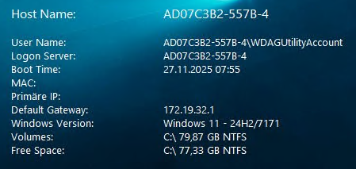

# BGinfoIntune

A Semi-Ready to Deploy Intune Package for BGInfo64 Version 4.33

##Features:
- Robust Install, Uninstall and Detection Routine
- Uninstall Routine purges ALL Data
- Detailed Logs for better debugging
- Hash-Sum based Detections
- Shortcuts are created in a way that users can delete it from their desktops
- Shortcuts are only created once unless Version missmatch
- Compatible with OneDrive Desktops

---

BGinfo is used to manage the background for clients and print some usefull Info onto it. 

--- 

To Start, change the image to your desired image. 

The Config.bgi contains all the configs for your background. There is also the custom scripts included. 

Please Remember to change the hash summs in the detect.ps1 script. 

---

## Intune Settings

### Install:
powershell.exe -ExecutionPolicy Bypass -WindowStyle Hidden -File install.ps1 

### Uninstall:
powershell.exe -ExecutionPolicy Bypass -WindowStyle Hidden -File uninstall.ps1

### ReturnCodes
Returncode "1" for "Retry"

### Detection Rule
Use Detection Script, default options

### Mode
Installation runs in SYSTEM-Mode

---

All EXE Files are from the official Repositorys. They are included for convinience. Please make sure you are only running SAFE Softwre and Software you Trust!!!

Create an Issue if you need assistance :3

Read the License!!